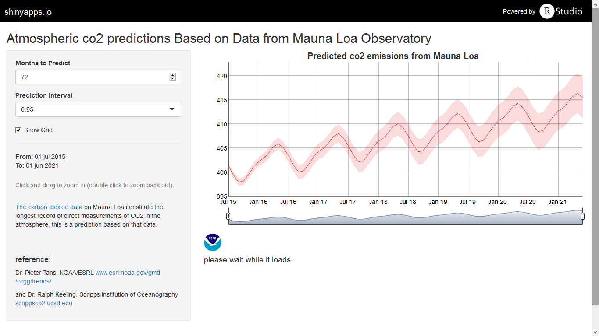

## Mauna Loa Co2 Data

- Data Sets pacakge that comes in R
- Inludes de Mauna Loa atmospheric meassures of Co2 from January 1958 to December 1997


```r
head(as.data.frame(co2))
```

```
##        x
## 1 315.42
## 2 316.31
## 3 316.50
## 4 317.56
## 5 318.13
## 6 318.00
```

```r
class(co2)
```

```
## [1] "ts"
```
--- .

## Mauna Loa Co2 Predictions

But the project that meassures Co2 in Mauna Loa is still running so there a larger data set now. [Mauna Loa web](http://www.esrl.noaa.gov/gmd/ccgg/trends/)

So the ShinyApp build generates a prediction bewtween 72 to 144 months, depending of what the user want.

Also you can zoom in or out a certain period.

[Link to the Shiny MaunaLoa App](https://rgfell.shinyapps.io/MaunaLoa)


--- .

## Mauna Loa R Data Set Visualization

We use dygraphs package to create the shinyApp. [dygraphs](https://rstudio.github.io/dygraphs/)

Sadly I couldnt make it to work with slidyf, so here is a code chunk of the Server file.

```
shinyServer(function(input, output) {
        
        predicted <- reactive({
                co <- HoltWinters(db.ts)
                predict(co, n.ahead = input$months, 
                        prediction.interval = TRUE,
                        level = as.numeric(input$interval))
        })
        
        output$dygraph <- renderDygraph({
                dygraph(predicted(), main = "Predicted co2 emissions from Mauna Loa") %>%
                        dySeries(c("lwr", "fit", "upr"), label = "Co2",
                                 color=RColorBrewer::brewer.pal(3, "Set1")) %>%
                        dyOptions(drawGrid = input$showgrid) %>% 
                        dyRangeSelector(input$series_date_window)
        })
        
```

--- 

## Mauna Loa Visualizing Predictions




